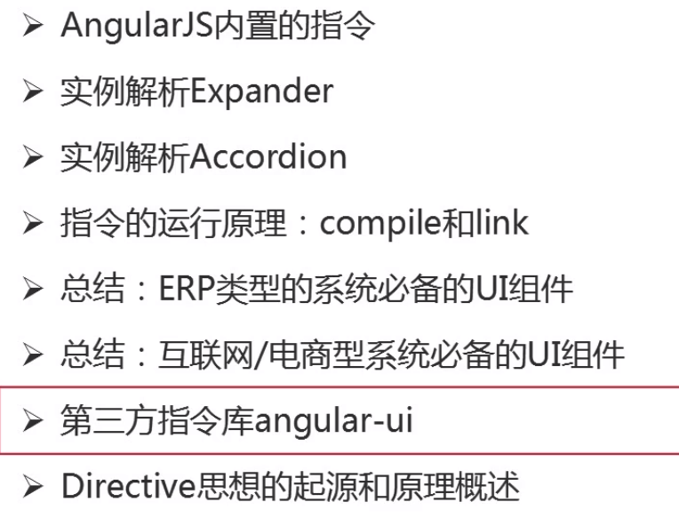

## 开发、调试、测试工具


 1. 代码编辑工具：Sublime、WebStorm
 2. 断点调试工具：Chrome插件Batarang
 3. 版本管理工具：Git
 4. 包管理工具：npm（node package module）
 5. 代码合并和混淆工具：Grunt
 6. 依赖管理工具：Bower（不建议使用，全面使用npm）
 7. 轻量级Server：http-server
 8. 单元测试Runner：Karma
 9. 单元测试工具：Jasmine
 10. 专门为AngularJS定制的测试工具：Protractor

## AngularJS目录结构

``` javascript
app/                    --> 项目的源文件
app.css               --> 默认的css文件
  components/           --> 所有应用程序的特定模块
    version/              --> 相关的组件
      version.js                 --> 基本模块的声明
      version_test.js            --> 基本模块的测试
      version-directive.js       --> 用户定义的指令
      version-directive_test.js  --> 用户定义的指令测试
      interpolate-filter.js      --> 用户定义的过滤器
      interpolate-filter_test.js --> 用户定义的过滤器测试
  view1/                --> view1视图模板和控制器
    view1.html            --> 局部模板
    view1.js              --> 控制器
    view1_test.js         --> 控制器的测试
  view2/                --> view2视图模板和控制器
    view2.html            --> 局部模板
    view2.js              --> 控制器
    view2_test.js         --> 控制器的测试
  app.js                --> 主项目模块
  index.html            --> 项目布局模板
  index-async.html      --> 就像index.html，但异步加载JS文件
karma.conf.js         --> 用于运行karma单元测试的配置文件
e2e-tests/            --> 端对端测试
  protractor-conf.js    --> Protractor配置文件
  scenarios.js          --> Protractor端对端测试的运行文件
```


## MVC模式

1. Controller使用过程中的注意点

	
	
2. 视图的复用，通过指令实现

	
	
3. AngularJS的MVC是借助于$scope实现的。

	3.1 $scope的作用

	
		
	3.2 $scope的生命周期
	
	
		
4. ng官方推荐的模块切分方式

	
	
	
	
5. 路由的基本原理

	
	
6. AngularJS指令

	
	
	
	
	restrict匹配模式
	
	
	
	compile与link函数：
	
	
	
	
	
	

# AngularJS权威教程

## $scope对象的生命周期

 1. 创建
	
	在创建控制器或指令时， AngularJS会用$injector创建一个新的作用域，并在这个新建的控
制器或指令运行时将作用域传递进去。
	
 2. 链接

	当Angular开始运行时，所有的$scope对象都会附加或者链接到视图中。所有创建$scope对
象的函数也会将自身附加到视图中。这些作用域将会注册当Angular应用上下文中发生变化时需
要运行的函数。

 3. 更新
 4. 销毁

