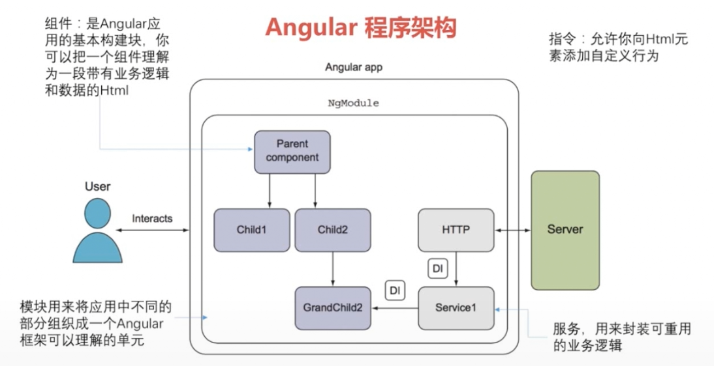

## Angular程序架构


## 环境搭建

 1. 安装node.js

	测试：在命令行中输入：

	``` shell
	ndoe -v	#查看node.js版本
	npm -v	#查看npm版本
	```
	
 2. 设置淘宝镜像

	``` shell
	npm config set registry  https://registry.npm.taobao.org
	```
	
 3. 安装angular命令行工具

	``` shell
	npm install -g @angular/cli@指定版本
	#测试，出现版本信息及安装成功
	ng -v
	```