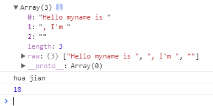
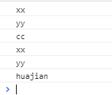
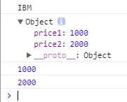
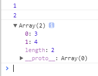
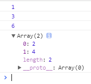
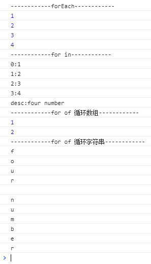

## TypeScript开发环境

 1. 在线compiler
	[在线compiler地址](http://www.typescriptlang.org/play/index.html)

 2. 安装本地compiler
	在命令行中输入：
	``` stylus
	npm install -g typescript
	```
	
 3. typescript代码编译为javascript代码
	使用tsc命令，将ts文件转为js文件：
	``` stylus
	tsc xxx.ts
	```
	
## 字符串新特性

 1. 多行字符串
    使用撇号``。

    ts代码：
    ``` stylus
    var content = `aaa
    bbb
    ccc`
    ```
    编译后的js代码：
    ``` stylus
    var content = "aaa\nbbb\nccc";
    ```
 2. 字符串模板
    避免大量的字符串拼接。
    ts代码：
    ``` stylus
    var myname = "huajian";

    var getName = function () { 
        return "huajian";
    }
    
    console.log(`<div>
    <span>${myname}</span>
    <span>${getName}</span>
    </div>`);
    ```
    编译后的js代码：
    ``` stylus
    var myname = "huajian";
    var getName = function () {
        return "huajian";
    };
    console.log("<div>\n<span>" + myname + "</span>\n<span>" + getName + "</span>\n</div>");
    ```
 3. 自动拆分字符串
    ts代码：
    ``` stylus
    function test(template, name, age) { 
        console.log(template); 
        console.log(name);
        console.log(age);
    }
    
    var myname = "hua jian";
    
    var getAge = function () { 
        return 18;
    }
    
    test`Hello myname is ${myname}, I'm ${getAge()}`;
    ```
    编译后的js代码：
    ``` stylus
    var __makeTemplateObject = (this && this.__makeTemplateObject) || function (cooked, raw) {
        if (Object.defineProperty) { Object.defineProperty(cooked, "raw", { value: raw }); } else { cooked.raw = raw; }
        return cooked;
    };
    function test(template, name, age) {
        console.log(template);
        console.log(name);
        console.log(age);
    }
    var myname = "hua jian";
    var getAge = function () {
        return 18;
    };
    test(__makeTemplateObject(["Hello myname is ", ", I'm ", ""], ["Hello myname is ", ", I'm ", ""]), myname, getAge());
    ```
    
    运行结果：
    
    
## 参数新特性

 1. 参数类型
    在参数声明后面用冒号来指定参数的类型。
    ts代码：
    ``` stylus
    //字符串类型
    var myname: String = "huajian";
    //任意类型
    var alias: any = "xixi";
    //数字类型
    var age: number = 18;
    //布尔类型
    var man: boolean = true;
    //方法参数、返回值设定类型
    function test(name:String): String { 
        return "";
    }
    //自定义类型
    class Person { 
        name: String;
        age: number;
    }
    
    var player: Person = new Person();
    player.name = "huajian";
    player.age = 18;
    ```
    编译后的js代码：
    ``` stylus
    //字符串类型
    var myname = "huajian";
    //任意类型
    var alias = "xixi";
    //数字类型
    var age = 18;
    //布尔类型
    var man = true;
    //方法参数、返回值设定类型
    function test(name) {
        return "";
    }
    //自定义类型
    var Person = /** @class */ (function () {
        function Person() {
        }
        return Person;
    }());
    var player = new Person();
    player.name = "huajian";
    player.age = 18;
    ```
 2. 参数默认值
    在参数声明后面用等号来指定参数的默认值。使用默认值的参数必须是最后一个参数。
    ts代码：
    ``` stylus
    function test(a:String, b:String, c:String="huajian") { 
        console.log(a);
        console.log(b);
        console.log(c);
    }
    
    test("xx", "yy", "cc");
    test("xx", "yy");
    ```
    编译后的js代码：
    ``` stylus
    function test(a, b, c) {
        if (c === void 0) { c = "huajian"; }
        console.log(a);
        console.log(b);
        console.log(c);
    }
    test("xx", "yy", "cc");
    test("xx", "yy");
    ```
    运行结果：
    
 3. 可选参数
    在方法的参数声明后面用问号来表明此参数为可选参数。
    可选参数必须声明在必选参数后面。
    ts代码：
    ``` stylus
    function test(a:String, b?:String, c:String="huajian") { 
        console.log(a);
        //使用可选参数必须处理没有传参时的情况
        console.log(b == null ? null : b);
        console.log(c);
    }
    test("xx");
    ```
    
## 函数新特性
 1. Rest and Spread操作符
    用来声明任意数量的方法参数。
    ts代码：
    ``` stylus
    function fun1(...args) { 
        args.forEach(function (arg) { 
            console.log(arg);
        });
    }
    
    fun1(1,2,3,4,5,6,7);
    ```
    编译后的js代码：
    ``` stylus
    function fun1() {
        var args = [];
        for (var _i = 0; _i < arguments.length; _i++) {
            args[_i] = arguments[_i];
        }
        args.forEach(function (arg) {
            console.log(arg);
        });
    }
    fun1(1, 2, 3, 4, 5, 6, 7);
    ```
 2. generator函数
    控制函数的执行过程，手工暂停和恢复代码执行。
 3. destructuring析构表达式
    通过表达式将对象或数组拆解成任意数量的变量。
    
    3.1. 从对象中取值：
    ts代码：
    ``` stylus
    function getStock() { 
        return {
            code: "IBM",
            price: {
                price1: 1000,
                price2: 2000
            }
        }
    }
    
    var { code: vcode, price, price: { price1, price2 } } = getStock();
    
    console.log(vcode);
    console.log(price);
    console.log(price1);
    console.log(price2);
    ```
    编译后的js代码：
    ``` stylus
    function getStock() {
        return {
            code: "IBM",
            price: {
                price1: 1000,
                price2: 2000
            }
        };
    }
    var _a = getStock(), vcode = _a.code, price = _a.price, _b = _a.price, price1 = _b.price1, price2 = _b.price2;
    console.log(vcode);
    console.log(price);
    console.log(price1);
    console.log(price2);
    ```
    运行结果：
    

    3.2. 从数组中取值：
    ts代码：
    ``` stylus
    var array = [1, 2, 3, 4];
    
    var [number1, number2, ...others] = array;
    
    console.log(number1);
    console.log(number2);
    console.log(others);
    ```
    编译后的js代码：
    ``` stylus
    var array = [1, 2, 3, 4];
    var number1 = array[0], number2 = array[1], others = array.slice(2);
    console.log(number1);
    console.log(number2);
    console.log(others);
    ```
    运行结果：
    

## 表达式和循环
 1. 箭头表达式
    用来声明匿名函数，消除传统匿名函数的this指针问题。
    ts代码：
    ``` stylus
    //单个参数
    var result1 = arg => arg;
    console.log(result1(1));
    //多参数
    var result2 = (arg1, arg2) => arg1 + arg2;
    console.log(result2(1, 2));
    //多行方法体
    var result3 = (arg1, arg2, arg3) => { 
        return arg1 + arg2 + arg3;
    }
    console.log(result3(1, 2, 3));
    //简单应用：打印数组中的偶数
    var myArray = [1, 2, 3, 4, 5];
    console.log(myArray.filter(value => value%2 == 0));
    ```
    编译后的js代码：
    ``` stylus
    //单个参数
    var result1 = function (arg) { return arg; };
    console.log(result1(1));
    //多参数
    var result2 = function (arg1, arg2) { return arg1 + arg2; };
    console.log(result2(1, 2));
    //多行方法体
    var result3 = function (arg1, arg2, arg3) {
        return arg1 + arg2 + arg3;
    };
    console.log(result3(1, 2, 3));
    //简单应用：打印数组中的偶数
    var myArray = [1, 2, 3, 4, 5];
    console.log(myArray.filter(function (value) { return value % 2 == 0; }));
    ```
    运行结果：
    
 
 2. 循环
    ts代码：
    ``` stylus
    var myArray = [1, 2, 3, 4];
    myArray.desc = "four number";
    //forEach循环：只能循环数组元素
    console.log("------------forEach------------");
    myArray.forEach(value => console.log(value));
    //for in循环：不仅能循环数组元素，还能循环数组属性
    console.log("------------for in------------");
    for (var n in myArray) { 
        console.log(n+":"+myArray[n]);
    }
    //for of循环：可以break
    console.log("------------for of 循环数组------------");
    for (var n of myArray) { 
        if (n > 2) break;
        console.log(n);
    }
    console.log("------------for of 循环字符串------------");
    for (var s of "four number") { 
        console.log(s);
    }
    ```
    编译后的js代码：
    ``` stylus
    var myArray = [1, 2, 3, 4];
    myArray.desc = "four number";
    //forEach循环：只能循环数组元素
    console.log("------------forEach------------");
    myArray.forEach(function (value) { return console.log(value); });
    //for in循环：不仅能循环数组元素，还能循环数组属性
    console.log("------------for in------------");
    for (var n in myArray) {
        console.log(n + ":" + myArray[n]);
    }
    //for of循环：可以break
    console.log("------------for of 循环数组------------");
    for (var _i = 0, myArray_1 = myArray; _i < myArray_1.length; _i++) {
        var n = myArray_1[_i];
        if (n > 2)
            break;
        console.log(n);
    }
    console.log("------------for of 循环字符串------------");
    for (var _a = 0, _b = "four number"; _a < _b.length; _a++) {
        var s = _b[_a];
        console.log(s);
    }
    ```
    运行结果：
    
    

## 面向对象特性


    


    


    


	
	


 
